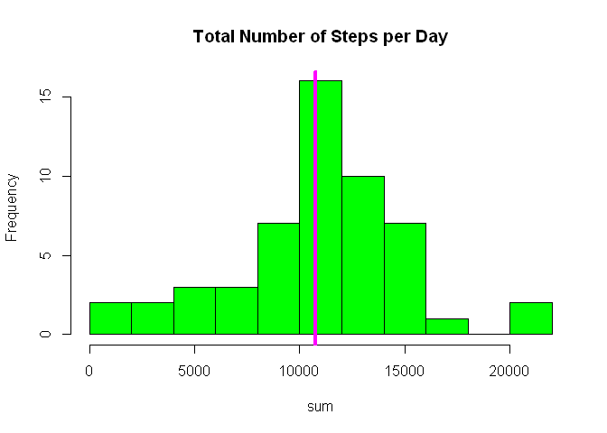
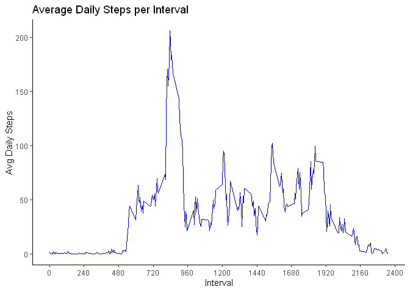
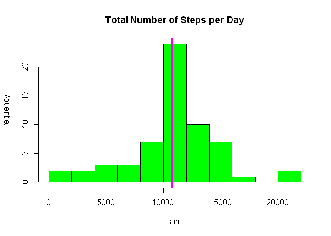
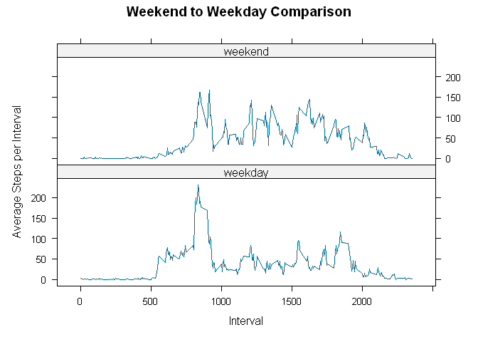

# Loading and preprocessing the data

------------------------------------------------------------------------

### Load packages


```r
library(tidyverse)
```

### Unzip folder


```r
unzip("D:/Education/R/Data/JH_C5_week2/repdata_data_activity.zip", exdir= "D:/Education/R/Data/JH_C5_week2/reproducable_walking_data")
```

### Read file


```r
activity <- read.csv("D:/Education/R/Data/JH_C5_week2/reproducable_walking_data/activity.csv")
```

### Convert date observations

-   First we'll look at the type of data in each column: it appears *date* is a "char" so we need to convert

-   Covert date from "char" to *date type*


```r
str(activity)
```

```
## 'data.frame':	17568 obs. of  3 variables:
##  $ steps   : int  NA NA NA NA NA NA NA NA NA NA ...
##  $ date    : chr  "2012-10-01" "2012-10-01" "2012-10-01" "2012-10-01" ...
##  $ interval: int  0 5 10 15 20 25 30 35 40 45 ...
```

```r
activity$date <- ymd(activity$date)
```

### Create new columns

#### wday

-   Creating a new column showing the day of the week would help us in the next step

#### weekend \| weekday

-   Create a new column showing weekdays and weekend days

-   These will be helpful if we ever need to compare activity levels on weekdays vs weekends or even if we wish to explore a relationship between day of week and activity level


```r
activity <- activity |> 
        mutate(day_of_week = wday(date, week_start = 1))
# create a weekend variable named weekend
activity <- activity |> 
        mutate(weekend = case_when(day_of_week >5 ~ "weekend",
                                        TRUE ~ "weekday"))
```

# Mean total number of steps taken per day?

------------------------------------------------------------------------

The question is a bit vague, do we mean the total number of steps taken per day for each day, or the total number of steps taken per day for the entire dataset?

Well I'll do both, because I'm curious myself regardless of the intent of the question.

-   Let's group the data by date, calculate the total number of steps per day and assign the values to ***mean_perday***

-   ***mean_perday*** now has two columns: *date* & *sum* where sum is the total steps taken per day


```r
mean_perday <- activity |> 
        group_by(date) |>
        summarise(sum = sum(steps))
```

### Total steps per day

-   Now that we have a column of daily total number of steps taken we can simply sum them all together to get the total number of steps taken per day for the entire dataset and assign it to **total_steps** **=570608**


```r
total_steps <- sum(mean_perday$sum, na.rm = TRUE)
total_steps
```

```
## [1] 570608
```

### Mean & median

-   To calculate the mean and median of the total number of steps taken per day we make use of *summary()* which will give us the needed answers
-   We get a **mean=10766 and a median=10765**


```r
summary(mean_perday$sum)
```

```
##    Min. 1st Qu.  Median    Mean 3rd Qu.    Max.    NA's 
##      41    8841   10765   10766   13294   21194       8
```

### Histogram

-   Plot a histogram for the distribution of total number of steps per day

-   The magenta line is the mean of the distribution


```r
with(mean_perday, hist(sum, col="green", breaks = 15,
                       main="Total Number of Steps per Day"))
abline(v= mean(mean_perday$sum, na.rm=TRUE), col="magenta",lwd=4)
```

<!-- -->

# What is the average daily activity pattern?

------------------------------------------------------------------------

-   The *activity* dataset from above shows that each day is divided into 288, 5 minute intervals, in order to look for patterns in daily use it might be wise to compare all the intervals to one another.

-   In order to do that we'll calculate the average steps taken for each of the 288 intervals for the entire dataset, and we can do that with the *aggregate()*

-   We'll save the results in ***activity_perinterval***


```r
activity_perinterval <- activity |> 
        aggregate(steps~interval, mean)
```

### Time series plot

-   Here we'll plot a time series line graph of the Average Daily Steps per interval to see if any pattern is evident


```r
ggplot(activity_perinterval, aes(interval,steps))+
        geom_line(color="blue") +
        labs(title = "Average Daily Steps per Interval", x="Interval", y="Avg Daily Steps")+
        scale_x_continuous(breaks = seq(0,2400, by=240))+
        theme_classic()
```

<!-- -->

### Most active interval

From the plot it is evident that a range of intervals and in particular one interval is by far more popular by the users. To find the exact interval

-   We can use one line of code as shown below, but let me explain it next:

-   Let's start from inside the []: ***which.max()*** scans through the *steps* column and returns the row where the maximum average *steps* resides

-   now that we have the row from above, when it's placed inside the [ , ] it targets that specific row of ***activity_perinterval***

-   The result shows that row ***104 is for interval 835*** and has the maximum average steps of 206 per 5 minutes interval

> The intervals are setup this way:
>
> -   **First interval is at 0 which is the start of the hour, and increases by 5 every 5 minutes**
>
> -   **Once we get to 55 the next increase puts us at the start of the next hour and therefore the interval counter become 100 NOT 60.**
>
> -   **So every hours from there the interval counter increases from 100, 200, 300....**
>
> -   **So interval 835 would be at 8:35 AM**


```r
activity_perinterval[which.max(activity_perinterval$steps),]
```

```
##     interval    steps
## 104      835 206.1698
```

# Imputing missing values

------------------------------------------------------------------------

### Count of NAs

-   First let's count how many NA are in the dataset? **Total NAs = 2304**

-   Then we find out what percentage of the total rows are NAs **(which turns out to be 2.6%)**


```r
sum(is.na(activity))
```

```
## [1] 2304
```

```r
mean(is.na(activity))
```

```
## [1] 0.02622951
```

## Replace NAs

### Mean of intervals

-   The plan is to replace each missing NA with the average of that specific interval it is found in.

-   In order to accomplish that, we need to calculate the mean of every interval for all the days in the dataset

-   We can accomplish that by using the ***group_by()*** and ***mutate()*** functions together to create a new column of all the interval means

-   Save the means in *interval_mean*


```r
activity_mean <- activity |> 
        group_by(interval) |> 
        mutate(interval_mean =  mean(steps, na.rm = TRUE))
```

### Coalesce

-   We go through every row in the df and replace every *step* which is NA with the mean value for that interval that can be found in the new column *interval_mean*

-   We save the new step values in *nona_steps*


```r
activity_mean$nona_steps <- coalesce(activity_mean$steps, activity_mean$interval_mean) 
```

### Total steps per day

-   Just as we did earlier in step 1, we need to calculate the average steps per day now that all the NAs have been replaced with the average for their respective interval.

-   We can do that just as we did earlier and we just replace with the new df ***nona_mean_perday***

-   Total steps for all days are: **656737 compared to 570608 before replacing the NAs**


```r
nona_mean_perday <- activity_mean |> 
        group_by(date) |>
        summarise(sum = sum(nona_steps))
nona_total_steps <- sum(nona_mean_perday$sum)
nona_total_steps
```

```
## [1] 656737.5
```

### Mean & median

-   To calculate the mean and median of the total number of steps taken per day we make use of summary() which will give us the needed answers

-   We get a **mean= 10766 and median=10766 compared to mean=10766 and median=10765**

-   **We shouldn't have anticipated any major changes since we replace the NAs with the mean of each interval**


```r
summary(nona_mean_perday$sum)
```

```
##    Min. 1st Qu.  Median    Mean 3rd Qu.    Max. 
##      41    9819   10766   10766   12811   21194
```

### Histogram

-   Plot a histogram for the distribution of total number of steps per day

-   The magenta line is the mean of the distribution


```r
with(nona_mean_perday, hist(sum, col="green", breaks = 15, main="Total Number of Steps per Day"))
abline(v= mean(nona_mean_perday$sum, na.rm=TRUE), col="magenta",lwd=4)
```

<!-- -->

### Observation

It might not be glaring but the distribution now is more concentrated around the mean. Look at the frequency count of the tallest bar it is considerably higher than before, and that again is due to replacing all the NAs with mean values.

# Weekdays vs Weekends

------------------------------------------------------------------------

-   If you remember when we got started I had created a column named *weekend* which separates the data by weekday vs weekend days

-   This comparison becomes fairly simple, all we have to do is aggregate the steps across 2 groups: interval and weekend

-   Just make sure we use the dataset that included all the repalced NAs *activity_mean*

-   Also ensure we use the accurate column that reflects the replaced NAs which would be *nona_steps*

-   Load the lattice library since I'll use lattice for this last plot


```r
library(lattice)
interval_weekday <- activity_mean |> 
        aggregate(nona_steps~interval + weekend, mean)
```

### Plot timeline


```r
xyplot(nona_steps~interval | weekend, interval_weekday,type="l",
       color="blue", xlab = "Interval", ylab = "Average Steps per Interval",
       pch=10, main="Weekend to Weekday Comparison",layout=c(1,2))
```

<!-- -->

### Observation

The visual shows a clear distinction between weekdays activity and weekend days:

-   On the weekends the activity level is more spread out throughout the day with lower max value.

-   On the weekdays the activity level is more focused at a certain time of day with a significant spike.

-   It appears that the users might be professional users that are more active around 8:38 am but then again we have no idea what time zone this data reflects?

-   Depending on what the business case is there are several possibilities to pursue from this limited data.
